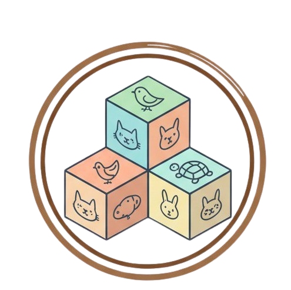

<p align="center">
  
</p>

<h1 align="center">Palcomtech Chicken Box (PCB)</h1>

<p align="center">
  <strong>Smart Poultry IoT Ecosystem</strong><br/>
  A full-stack IoT solution for real-time monitoring and remote control of chicken coop environments.
</p>

<p align="center">
  
  
  
  
  
  
</p>

---

## Table of Contents

- [Project Overview](#-project-overview)
- [System Architecture](#-system-architecture)
- [Tech Stack](#-tech-stack)
- [Key Features](#-key-features)
- [Architecture Highlights](#-architecture-highlights)
- [Project Structure](#-project-structure)
- [Getting Started](#-getting-started)
- [Environment Configuration](#-environment-configuration)
- [API Reference](#-api-reference)
- [Authors](#-authors)

---

## 📋 Project Overview

**Palcomtech Chicken Box (PCB)** is an end-to-end IoT ecosystem designed to modernize poultry farm management. The system connects ESP32-based sensor hardware inside chicken coops to a cloud backend, enabling farmers to monitor environmental conditions and control equipment from anywhere via a mobile application.

The platform addresses three critical challenges in poultry farming:

| Challenge | Solution |
|-----------|----------|
| **Manual monitoring** of temperature, humidity, and air quality | Automated sensor readings with alert thresholds |
| **Delayed response** to dangerous environmental conditions | Real-time push alerts and remote device control |
| **Single-operator limitation** on farm management | Role-based multi-user access with device assignment |

### How It Works

```
┌─────────────┐     WiFi      ┌──────────────┐    HTTPS     ┌─────────────────┐
│   ESP32 +   │ ────────────► │   FastAPI     │ ◄──────────► │  Flutter App    │
│   Sensors   │   Heartbeat   │   Backend     │   REST API   │  (Android/iOS)  │
│   Actuators │ ◄──────────── │   PostgreSQL  │              │                 │
└─────────────┘   Commands    └──────────────┘              └─────────────────┘
     │                              │
     │  DHT11 (Temp/Humidity)       │  JWT Authentication
     │  MQ135 (Ammonia/NH₃)        │  Role-Based Access
     │  Servo Motors (Actuators)    │  Cloudflare CDN/WAF
     │  Relay Modules               │
```

---

## 🏗 System Architecture

The PCB ecosystem consists of three independent layers:

| Layer | Technology | Responsibility |
|-------|-----------|----------------|
| **IoT Hardware** | ESP32, DHT11, MQ135, Servo, Relay | Sensor data collection, actuator control, WiFi connectivity |
| **Cloud Backend** | FastAPI, PostgreSQL, JWT, Cloudflare | REST API, authentication, data persistence, rate limiting |
| **Mobile Frontend** | Flutter, Dio, Firebase Auth | User interface, real-time monitoring, device management |

This repository contains the **Mobile Frontend** layer.

---

## 🛠 Tech Stack

### Frontend (This Repository)

| Category | Technology | Version | Purpose |
|----------|-----------|---------|---------|
| **Framework** | Flutter | 3.x | Cross-platform mobile UI |
| **Language** | Dart | 3.x | Application logic |
| **HTTP Client** | Dio | ^5.4.0 | REST API communication with interceptors |
| **Authentication** | Firebase Auth | ^6.2.0 | Google Sign-In & email/password auth |
| **Token Storage** | Flutter Secure Storage | ^9.0.0 | Hardware-backed JWT persistence |
| **QR Scanner** | Mobile Scanner | ^7.2.0 | Device claiming via QR code |
| **Bluetooth** | Flutter Blue Plus | 1.31.18 | ESP32 WiFi provisioning via BLE |
| **Permissions** | Permission Handler | ^12.0.1 | Runtime permission management |
| **Environment** | Flutter Dotenv | ^6.0.0 | `.env` configuration loading |

### Backend (Separate Repository)

| Category | Technology | Purpose |
|----------|-----------|---------|
| **Framework** | FastAPI (Python) | Async REST API |
| **Database** | PostgreSQL | Relational data persistence |
| **Auth** | JWT (HS256, 7-day expiry) | Stateless authentication |
| **CDN/WAF** | Cloudflare | DDoS protection, SSL termination |
| **Hosting** | `pcb.my.id` | Production deployment |

### IoT Hardware

| Component | Model | Function |
|-----------|-------|----------|
| **Microcontroller** | ESP32 | WiFi connectivity, sensor reading, actuator control |
| **Temperature/Humidity** | DHT11 | Ambient temperature and relative humidity sensing |
| **Gas Sensor** | MQ135 | Ammonia (NH₃) concentration detection |
| **Actuators** | Servo Motors, Relay Modules | Fan, light, pump, and feeder control |

---

## ✨ Key Features

### 1. Role-Based Access Control (RBAC)

A hierarchical permission system ensures secure multi-tenant device management:

| Role | Permissions | Use Case |
|------|------------|----------|
| **Super Admin** | Full system access, user management, all devices | Platform administrator |
| **Admin** | Device management, user assignment, control | Farm owner |
| **Operator** | Monitor sensors, control actuators | Farm worker |
| **Viewer** | Read-only sensor data access | Stakeholder, investor |

### 2. Device Management & Team Collaboration

- **QR Code Claiming** — Scan a device's QR code to register it to your account via `POST /api/devices/claim`
- **Device Assignment** — Owners can invite team members by email and assign `Operator` or `Viewer` roles
- **"Kelola Akses" Panel** — Device owners see a dedicated access management button; non-owners see only monitoring controls

### 3. Real-Time Environmental Monitoring

The app displays live sensor data from each chicken coop:

| Sensor | Metric | Unit | Alert Threshold |
|--------|--------|------|-----------------|
| **Suhu** (Temperature) | Ambient temperature | °C | Configurable per device |
| **Kelembapan** (Humidity) | Relative humidity | % | Configurable per device |
| **Amonia** (Ammonia) | NH₃ concentration | ppm | Configurable per device |

- **"Riwayat" Page** — Historical sensor logs with paginated data (newest first)
- **"Aktivitas" Tab** — Alert history filtered to readings where `is_alert = true`

### 4. Remote Device Control

Four controllable components per coop, each with independent toggle switches:

| Component | API Value | Function |
|-----------|-----------|----------|
| **Kipas** (Fan) | `kipas` | Ventilation control |
| **Lampu** (Light) | `lampu` | Coop lighting |
| **Pompa** (Pump) | `pompa` | Water pump system |
| **Pakan Otomatis** (Auto Feeder) | `pakan_otomatis` | Automated feeding |

- **Optimistic UI Updates** — Switches toggle instantly; rollback on API failure
- **Per-Switch Loading** — Individual loading indicators prevent UI blocking
- **Backend as Source of Truth** — Device state always reconciled with server response

### 5. BLE WiFi Provisioning

The **"Perangkat"** page enables first-time ESP32 setup:

1. Enable Bluetooth scanner to discover nearby ESP32 devices
2. Connect via BLE (MTU 512 for Android stability)
3. Send WiFi credentials (SSID + password) as JSON over BLE characteristic
4. ESP32 restarts and connects to the configured network

### 6. Security Architecture

| Layer | Mechanism | Detail |
|-------|-----------|--------|
| **Transport** | HTTPS + Cloudflare WAF | All API traffic encrypted, DDoS protected |
| **Authentication** | Firebase → JWT exchange | Firebase ID token exchanged for backend JWT |
| **Token Storage** | Android Keystore / iOS Keychain | Hardware-backed encryption via `flutter_secure_storage` |
| **Keystore Recovery** | Auto-corruption detection | Detects `BadPaddingException` on reinstall, clears corrupted data gracefully |
| **Auto Backup** | Disabled (`allowBackup="false"`) | Prevents Android backup/restore Keystore mismatch |
| **Session Management** | Global 401/403 interceptor | Automatic logout on token expiry or account deactivation |
| **Rate Limiting** | Per-endpoint limits | Login: 10/min, Control: 30/min, Logs: 60/min |

---

## 🧱 Architecture Highlights

### Networking Layer

```
┌─────────────────────────────────────────────────────┐
│                     DioClient                       │
│                   (Singleton)                       │
│                                                     │
│  ┌─────────────────┐    ┌────────────────────────┐  │
│  │ AuthInterceptor │    │   Base Configuration   │  │
│  │                 │    │                        │  │
│  │ • Auto-inject   │    │ • 30s timeout          │  │
│  │   Bearer token  │    │ • JSON content-type    │  │
│  │ • Handle 401 →  │    │ • Base URL from .env   │  │
│  │   global logout │    │                        │  │
│  │ • Handle 403 →  │    └────────────────────────┘  │
│  │   force logout  │                                │
│  └─────────────────┘                                │
└─────────────────────────────────────────────────────┘
                          │
                          ▼
┌─────────────────────────────────────────────────────┐
│                   TokenManager                      │
│                   (Singleton)                       │
│                                                     │
│  • JWT read/write with Keystore corruption guard    │
│  • User info persistence (email, role, UUID)        │
│  • Logout event stream (reactive, framework-agnostic)│
│  • Android: resetOnError for Keystore recovery      │
└─────────────────────────────────────────────────────┘
```

### Error Handling Pipeline

All API errors are mapped to typed exceptions for precise UI feedback:

```
DioException → AuthInterceptor → ApiException subclass → ErrorHandler → UI
                                        │
                    ┌───────────────────┼───────────────────┐
                    ▼                   ▼                   ▼
            UnauthorizedException  ValidationException  RateLimitException
            → Redirect to login    → Field-level errors → "Coba lagi" snackbar
```

### Service Layer Pattern

```dart
// All services use DioClient singleton — no manual token handling
class DeviceService {
  final Dio _dio = DioClient().dio;  // Token injected automatically

  Future<PaginatedResponse<Device>> getDevices({int page = 1}) async {
    final response = await _dio.get(ApiConfig.devicesUrl, queryParameters: {'page': page});
    return PaginatedResponse.fromJson(response.data, Device.fromJson);
  }
}
```

---

## 📁 Project Structure

```
lib/
├── main.dart                          # App entry point, Keystore corruption detection
├── constants/
│   ├── api_config.dart                # Base URL, all endpoint definitions
│   ├── app_colors.dart                # Design system color constants & themes
│   └── floating_navbar.dart           # Bottom navigation bar & app bar widgets
├── core/
│   └── network/
│       ├── api_exception.dart          # Typed exception hierarchy (11 classes)
│       ├── auth_interceptor.dart       # JWT injection, 401/403 global handling
│       ├── dio_client.dart             # Singleton Dio instance configuration
│       └── token_manager.dart          # Secure storage with corruption recovery
├── models/
│   ├── auth/
│   │   ├── login_request.dart          # Firebase token exchange request
│   │   ├── login_response.dart         # JWT + user info response
│   │   └── user_info.dart              # User model (email, role, UUID)
│   ├── common/
│   │   └── paginated_response.dart     # Generic pagination wrapper
│   └── device/
│       ├── device.dart                 # Device model with sensor state
│       ├── device_assignment.dart       # User-device role assignment
│       ├── device_component.dart        # Enum: kipas, lampu, pompa, pakan_otomatis
│       └── sensor_log.dart             # Sensor reading with alert metadata
├── pages/
│   ├── login_page.dart                 # Firebase auth + backend JWT exchange
│   ├── register_page.dart              # Account registration flow
│   ├── home_screen.dart                # Main navigation hub, UUID backfill
│   ├── device_list_page.dart           # Paginated device dashboard
│   ├── device_detail_page.dart         # Sensor data + control switches
│   ├── device_assignment_page.dart     # Team access management (Kelola Akses)
│   ├── devices_page.dart               # BLE WiFi provisioning (Setup Jaringan)
│   ├── scan_page.dart                  # QR code device claiming
│   ├── history_page.dart               # Historical logs + alert activity
│   └── profile_page.dart               # User profile + logout
├── routes/
│   └── app_routes.dart                 # Named route definitions
├── services/
│   ├── auth_service.dart               # Login/logout with TokenManager integration
│   └── device_service.dart             # Device CRUD, control, assignment operations
└── utils/
    └── error_handler.dart              # Centralized UI error feedback (8 methods)
```

---

## 🚀 Getting Started

### Prerequisites

| Requirement | Version |
|-------------|---------|
| Flutter SDK | >= 3.0.0 |
| Dart SDK | >= 3.0.0 |
| Android Studio / VS Code | Latest |
| Firebase Project | Configured with Auth enabled |

### Installation

```bash
# 1. Clone the repository
git clone https://github.com/your-org/palcomtech-chicken-box.git
cd palcomtech-chicken-box

# 2. Install dependencies
flutter pub get

# 3. Create environment file
cp .env.example .env
# Edit .env with your backend URL

# 4. Run the app
flutter run
```

### Build for Production

```bash
# Android APK
flutter build apk --release

# Android App Bundle (for Play Store)
flutter build appbundle --release
```

---

## ⚙ Environment Configuration

Create a `.env` file in the project root:

```env
BASE_URL=https://pcb.my.id
```

| Variable | Required | Description |
|----------|----------|-------------|
| `BASE_URL` | Yes | Backend API base URL (without `/api` suffix) |

> **Note:** The `/api` prefix is automatically appended by `ApiConfig` for all endpoint calls.

---

## 📖 API Reference

This project strictly follows the **API Contract** documented in [`API_CONTRACT.md`](API_CONTRACT.md).

### Key Endpoints

| Method | Endpoint | Rate Limit | Description |
|--------|----------|------------|-------------|
| `POST` | `/api/auth/firebase/login` | 10/min | Exchange Firebase token for JWT |
| `GET` | `/api/devices` | 30/min | List user's devices (paginated) |
| `POST` | `/api/devices/claim` | 10/min | Claim device via MAC address |
| `POST` | `/api/devices/{id}/control` | 30/min | Send control command |
| `GET` | `/api/devices/{id}/logs` | 60/min | Historical sensor data |
| `GET` | `/api/devices/{id}/alerts` | 60/min | Alert history |
| `POST` | `/api/devices/{id}/assign` | 20/min | Assign user to device |
| `DELETE` | `/api/devices/{id}/assign/{uid}` | 20/min | Remove user assignment |
| `GET` | `/api/users/me` | 30/min | Current user profile |

### Response Format

All paginated endpoints return:

```json
{
  "data": [ ... ],
  "total": 500,
  "page": 1,
  "limit": 20,
  "total_pages": 25
}
```

### Authentication

All authenticated requests require:

```
Authorization: Bearer <jwt_token>
```

Token lifetime: **7 days** | Algorithm: **HS256**

---

## 👤 Authors

| Role | Name | Affiliation |
|------|------|-------------|
| **Lead Developer** | Bagus Ardiansyah | Palcomtech |

---

## 📄 License

This project is proprietary software developed for Palcomtech. All rights reserved.

---

<p align="center">
  <sub>Built with 🐔 and ☕ at Palcomtech</sub>
</p>
